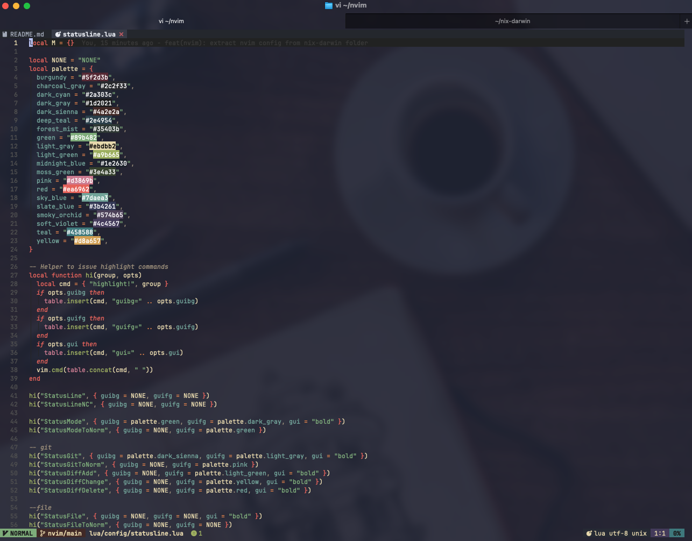

# My Neovim config

> Fast, IDE-grade Neovim setup with 14 plugins using native `vim.pack` (no plugin manager needed)


- Sub-50ms startup using native `vim.pack` (no lazy.nvim/packer overhead)
- Custom UI components (statusline, tabline, session manager) without extra plugins
- 15+ LSP servers pre-configured with format-on-save
- Session persistence that restores your workspace as VSCode

## Core Plugins

| Plugin                   | Purpose                                                                   |
| ------------------------ | ------------------------------------------------------------------------- |
| blink.cmp                | Completion with LSP, snippets, fuzzy matching                             |
| codeme.nvim (optional)   | Coding time tracker / dashboard                                           |
| fff.nvim                 | File finder and live grep picker                                          |
| gitsigns.nvim            | Git signs in the gutter, hunk navigation, line blame                      |
| grug-far.nvim            | Search & replace across files                                             |
| nvim-dap (optional)      | Debug Adapter Protocol client                                             |
| nvim-dap-view (optional) | DAP UI panel (scopes, breakpoints, watches, threads)                      |
| nvim-treesitter          | Syntax highlighting, code folding, indentation                            |
| nvim-web-devicons        | File type icons                                                           |
| oil.nvim                 | File explorer                                                             |
| render-markdown.nvim     | Rich markdown rendering in the buffer (browser preview with cli mdserve)  |
| vdiff.nvim               | Side-by-side diff viewer, merge conflict resolution, gitlab/github review |
| which-key.nvim           | Command palette & keybind helper                                          |
| yanky.nvim               | Yank ring with cycling, history picker, put highlighting                  |

## Minimal custom features (no plugins required)

| Feature           | File                     | Description                                                                                        |
| ----------------- | ------------------------ | -------------------------------------------------------------------------------------------------- |
| Custom Catppuccin | `config/theme.lua`       | Gruvbox-inspired palette, highlight overrides for plugins, syntax, treesitter, LSP semantic tokens |
| Auto-pairs        | `config/pairs.lua`       | Insert-mode auto-close for brackets, and smart backspace                                           |
| Statusline        | `config/statusline.lua`  | Git branch/diff, LSP diagnostics, word count for markdown                                          |
| Tabline           | `config/tabline.lua`     | Smart buffer management with devicons                                                              |
| Session manager   | `config/session.lua`     | Per-directory auto-save/restore                                                                    |
| LSP utilities     | `config/lsp.lua`         | Unified 15+ server setup with format-on-save, inlay hints                                          |
| Diagnostics       | `config/diagnostics.lua` | Custom diagnostic display config                                                                   |
| Pack UI           | `config/pack.lua`        | Browser for `vim.pack` plugin registry                                                             |
| Jump              | `config/jump.lua`        | Minimal 2-char search with label jump                                                              |
| UI overrides      | `config/ui2.lua`         | Floating windows, cmdline                                                                          |

I also wrote a series of articles about my [Neovim config](https://tduyng.com/tags/neovim/)

## Installation

```bash
# Backup existing config
mv ~/.config/nvim ~/.config/nvim.bak

# Clone
git clone https://gitlab.com/tduyng/nvim.git ~/.config/nvim

# Launch (plugins install automatically)
nvim
```

Prerequisites: Neovim 0.13+, Git, Ripgrep, Nerd Font

Update plugins: `<leader>pu` or `:lua vim.pack.update()`

## Development

Validate the config before committing:

```bash
just validate  # Run all checks (loads config in headless nvim + checks formatting)
just check     # Test config loads without errors
just fmt       # Format all Lua files with StyLua
```

## Quick Start

Leader key: `Space`

### Essential keybindings

```
Files & Search
  <leader>ff        Find files (fff.nvim)
  <leader>fg        Live grep (fff.nvim)
  <leader>fw        Grep word/selection (fff.nvim)
  <leader>fc        Find config file (fff.nvim)
  <leader>fr        Recent files (fff.nvim)
  <leader><space>   Smart find files (fff.nvim)
  <leader>/         Grep (fff.nvim)
  <leader>e         File explorer (oil.nvim)
  -                 Open parent directory (oil.nvim)
  <leader>E         File explorer (tree, netrw)
  <leader>sr        Search & replace (grug-far.nvim)

Buffers
  <leader>fb        Buffers (picker)
  <leader>bd        Delete buffer
  <leader>bo        Delete other buffers
  <leader>bb        Switch to other buffer
  <leader>bl        Close all left buffers
  <leader>br        Close all right buffers
  <Tab>/<S-Tab>     Next/Previous buffer
  <S-h>/<S-l>       Previous/Next buffer
  [b / ]b           Previous/Next buffer

Windows
  Ctrl-h/j/k/l      Navigate windows
  <leader>sv        Vertical split
  <leader>sh        Horizontal split
  <leader>ww        Other window
  <leader>wd        Delete window
  <leader>w-        Split window below
  <leader>w|        Split window right
  <leader>w=        Equalize window sizes
  <leader>wH/J/K/L  Move window

Tabs
  <leader><tab><tab>  New tab
  <leader><tab>]     Next tab
  <leader><tab>[     Previous tab
  <leader><tab>d     Close tab
  <leader><tab>o     Close other tabs
  <leader><tab>f     First tab
  <leader><tab>l     Last tab
  <leader><tab>n     New tab with current buffer
  <leader><tab>m     Move tab

LSP (native)
  gd                Goto definition
  gD                Goto declaration
  gR                References
  gI                Goto implementation
  gy                Goto type definition
  K / <leader>k     Hover documentation
  <leader>ca        Code actions
  <leader>cl        Fix all (LSP)
  <leader>cr        Rename
  <leader>ss        Document symbols
  <leader>cw        Workspace diagnostics

Git (vdiff.nvim)
  <leader>gg        LazyGit
  <leader>gc        Git: compare (universal)
  <leader>gC        Git: compare two refs
  <leader>gd        Git: working tree diff
  <leader>gD        Git: staged diff
  <leader>gf        Git: diff file vs HEAD
  <leader>gF        Git: diff file (universal)
  <leader>gV        Git: file history
  <leader>gv        Git: line history
  <leader>gx        Git: close all
  <leader>gm        Git: merge conflicts
  <leader>gr...     Git: review prefix (MR/PR)

Debug (DAP)
  <leader>db        Toggle breakpoint
  <leader>dc        Run/Continue
  <leader>di        Step into
  <leader>do        Step out
  <leader>dO        Step over
  <leader>du        DAP view toggle
  <leader>dh        DAP hover

Diagnostics
  <leader>cd        Line diagnostics
  <leader>sd        Document diagnostics (picker)
  <leader>cD        Workspace diagnostics (picker)
  ]d / [d           Next/Prev diagnostic
  ]e / [e           Next/Prev error
  ]w / [w           Next/Prev warning

Quickfix / Location
  <leader>xq        Quickfix list
  <leader>xl        Location list
  [q / ]q           Previous/Next quickfix
  <leader>cn/cp     Next/Previous quickfix
  <leader>co/cc     Open/Close quickfix
  <leader>ln/lp     Next/Previous location
  <leader>lo/lc     Open/Close location

Markdown
  <leader>um        Toggle render markdown
  <leader>mp        Markdown preview (mdserve)

Sessions
  <leader>qs        Load session (cwd)
  <leader>ql        Load last session
  <leader>qS        Select session
  <leader>qd        Stop session saving
  <leader>qr        Delete current session

Pack (vim.pack)
  <leader>pp        Pack UI
  <leader>pu        Pack update all
  <leader>pd        Pack delete plugin

UI toggles
  <leader>uw        Toggle wrap
  <leader>uL        Toggle relative number
  <leader>ul        Toggle line number
  <leader>uc        Toggle conceal level
  <leader>uA        Toggle tabline
  <leader>uf        Toggle autoformat
  <leader>us        Toggle spell
  <leader>R         Restart Neovim
```

## Screenshots




---

## License

MIT
